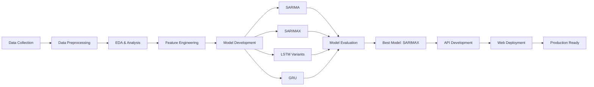

# 🏨 Hotel Online Revenue Forecasting: Time Series Prediction untuk Optimasi Revenue Management

> **Tantangan Industri Hospitality di Era Digital**  
> *"Okupansi hotel yang fluktuatif dan over-dependence pada OTA menyebabkan forecast revenue tidak stabil, margin tergerus komisi tinggi, dan kesulitan prediksi pickup di tengah tren last-minute booking"*

[](https://www.python.org/downloads/)
[](https://tensorflow.org/)
[](https://fastapi.tiangolo.com/)
[](#)
[](https://synergysquad.up.railway.app/)

---

## 📋 **Project Overview**

Proyek ini mengembangkan sistem forecasting revenue untuk **FIT Online Revenue** (booking individual via OTA & direct online) menggunakan **teknik time series dan deep learning** untuk membantu hotel dalam merencanakan strategi pricing & distribusi di tengah persaingan OTA yang ketat dan dampak regulasi fiskal PPN 12% (2025).

### 🎯 **Key Objectives**
- ✅ **Membangun Model Forecasting Akurat** untuk memprediksi FIT Online Revenue
- ✅ **Membantu Strategi Pricing & Distribusi** berbasis data-driven insights
- ✅ **Mengurangi Risiko Over/Under-Forecasting** yang berdampak ke cashflow
- ✅ **Memberikan Dasar Data-Driven** untuk keputusan sales & marketing

### 📦 **Repository Scope**

Repository ini fokus pada **model development dan research** untuk Hotel Revenue Forecasting:
- ✅ Data preprocessing & exploratory data analysis
- ✅ Model experimentation (SARIMA, SARIMAX, LSTM, GRU)
- ✅ Model evaluation & performance comparison
- ✅ Best model selection & validation (SARIMAX)
- ✅ Research documentation & insights

**Note:** Production deployment (API & Web Application) dikembangkan oleh tim deployment di repository terpisah.

---

## 🏆 **Project Results**

### 📊 **Performance Achievement**
```
🎉 BEST MODEL: SARIMAX
📈 Test RMSE: 3.56M (Lowest Error)
🏆 MAPE: 7.897% (Highly Accurate)
📊 MASE: 0.146 (Outperform Baseline)
⚡ Deployment: Live Production Ready
```

### 📈 **Model Comparison**
| Model | Train RMSE | Test RMSE | MAPE (%) | MASE | Status |
|-------|------------|-----------|----------|------|--------|
| **SARIMAX** | **2.63M** | **3.56M** | **7.897** | **0.146** | ✅ **DEPLOYED** |
| SARIMA | 15.68M | 20.80M | 68.349 | 0.874 | Baseline |
| GRU | 20.37M | 26.00M | 74.058 | 1.043 | Good Alternative |
| Single LSTM | 15.92M | 28.96M | 78.150 | 1.102 | Overfitting |
| Stacked LSTM | 19.02M | 29.24M | 71.803 | 1.056 | Stable but Limited |
| Bidirectional LSTM | 18.93M | 29.26M | 84.765 | 1.183 | Overfit |

---

## 📊 **Data Collection & Preparation**

### 🗂️ **Dataset Overview**
- **🏨 Sumber Data:** Hotel bintang 4, brand internasional di Indonesia
- **📅 Periode:** 1 Januari 2024 - 14 Agustus 2025
- **📈 Total Rows:** 9,654 transaksi booking
- **📊 Total Columns:** 5 atribut
- **🎯 Target:** Revenue Forecasting per channel/room type

### 📋 **Data Structure**
| Variabel | Type | Deskripsi | Makna Bisnis |
|----------|------|-----------|--------------|
| `Date` | DateTime | Tanggal transaksi | **Timeline analysis** |
| `Channel Name` | String | Nama OTA/channel | **Distribution channel** |
| `Room Type` | String | Tipe kamar | **Product segmentation** |
| `Room Nights` | Integer | Jumlah malam | **Volume metric** |
| `Revenue` | Float | Pendapatan | **Target variable** |

### 🔐 **Data Compliance**
- ✅ Data nyata dari hotel aktif
- ✅ Telah melalui proses **kurasi dan anonimisasi**
- ✅ **GDPR compliant** - tidak ada data pribadi/sensitif
- ✅ Privacy dan keamanan data terjaga

---

## 🔍 **Business Context**

### 📊 **Market Challenges**
- **📱 Digital Shift:** Mobile booking & last-minute booking trend
- **💰 OTA Dominance:** Traveloka, Tiket.com makin dominan
- **📉 High Commission:** Margin tergerus komisi OTA tinggi
- **📈 Price Competition:** Persaingan rate & visibilitas tinggi
- **💸 Fiscal Impact:** PPN 12% (2025) menekan pricing power

### 🎯 **Revenue Distribution Insights**
- **🥇 Traveloka:** Rp 7.6 miliar (largest contributor)
- **🥈 Agoda:** Rp 5.2 miliar
- **🥉 MG Jarvis:** Rp 4.2 miliar
- **📊 Klinkbook & Expedia:** Rp 2.7 miliar masing-masing
- **💡 Finding:** Revenue sangat terkonsentrasi pada 3-5 top channels

---

## 🛠️ **Methodology**

### 🔄 **System Workflow**


### 📈 **Exploratory Data Analysis**

#### **Revenue Trend Insights**
- **📊 Daily Fluctuation:** Revenue harian sangat fluktuatif
- **🎉 Peak Season:** Pertengahan 2024 (>Rp 200 juta/hari)
- **📉 Low Season:** Awal 2025 relatif lebih rendah
- **🎯 Seasonality:** Clear pattern liburan & low season
- **⚡ Outliers:** Spike dari event/promosi tertentu

### 🔧 **Data Preprocessing**

#### **Missing Value Handling**
- ✅ Revenue & Room Nights: Data kosong dihapus
- ✅ Kategori kosong: Diisi dengan label 'Unknown'
- ✅ Dataset bersih dan siap untuk modeling

#### **Feature Encoding**
- **One-Hot Encoding:** Channel Name (representasi biner per channel)
- **Label Encoding:** Kolom kategori lain (nilai numerik)
- ✅ Semua atribut siap diproses model forecasting

---

## 🤖 **Model Development**

### 📊 **Models Tested**

#### **1. SARIMA (Baseline)**
- **Purpose:** Baseline model untuk time series
- **Result:** MAPE 68.35%, kurang akurat pada fluktuasi
- **Insight:** Cukup tangkap pola umum, kurang responsif musiman

#### **2. SARIMAX (Best Model)** ⭐
- **Architecture:** SARIMA + Exogenous Variables
- **Key Variables:** Room Nights, Meal Plan, Length of Stay
- **Performance:** MAPE 7.897%, RMSE 3.56M
- **Strength:** Menangkap pola tren & musiman dengan sangat baik
- **Validation:** Lolos semua uji diagnostik, residual "white noise"

#### **3. LSTM Variants**
- **Single LSTM Dropout:** RMSE 28.96M, indikasi overfitting
- **Stacked LSTM:** RMSE 29.24M, lebih stabil namun tidak unggul
- **Bidirectional LSTM:** RMSE 29.26M, cenderung overfit
- **Batch Norm + L1/L2:** RMSE 33.55M, performa buruk

#### **4. GRU**
- **Performance:** RMSE 26.00M, lebih efisien dari LSTM
- **Insight:** Seimbang dan stabil, alternatif baik setelah SARIMAX

---

## 🚀 **Deployment**

Model terbaik (SARIMAX) telah di-deploy ke production environment oleh tim deployment:

### 🌐 **Live Application**
- **🔗 API Backend:** [https://backendsynergy-production.up.railway.app/docs](https://backendsynergy-production.up.railway.app/docs)
- **🌍 Web Frontend:** [https://synergysquad.up.railway.app/](https://synergysquad.up.railway.app/)
- **⚡ Status:** Production Ready & Live

### 👨‍💻 **Deployment Information**
- **Deployment Engineer:** [@IPutuFerryWistika](https://github.com/putuwistika)
- **Deployment Repository:** [https://github.com/putuwistika/backend_synergy](https://github.com/putuwistika/backend_synergy)
- **Tech Stack:** FastAPI, Railway, Modern Web Framework
- **Features:** Interactive dashboard, API documentation, real-time forecasting

**Note:** Deployment dan maintenance dilakukan di repository terpisah oleh tim deployment. Silakan kunjungi repository deployment untuk detail implementasi API dan web application.

---

## 📊 **Business Impact**

### 💰 **Revenue Management Benefits**
- **📈 Dynamic Pricing:** Menyesuaikan harga kamar sesuai demand & tren
- **💵 Revenue Optimization:** Prediksi akurat untuk strategi penjualan
- **🎯 Sales & Marketing:** Menentukan periode promosi tepat
- **👥 Operational Planning:** Proyeksi okupansi untuk resource planning
- **📊 Owner Reporting:** Insight berbasis data untuk keputusan strategis

### 🎯 **Operational Benefits**
- **⏰ Fast Decision Making:** Real-time forecasting via web app
- **💻 Accessible:** Ringan untuk hotel budget
- **📈 Cost Effective:** Implementasi hemat biaya
- **🔄 Automated:** Mengurangi manual forecasting effort
- **🎓 Data-Driven:** Keputusan berbasis insight, bukan feeling

---

## 🚀 **Installation & Usage**

### 📦 **Prerequisites**
```bash
Python 3.8+
pip install -r requirements.txt
```

### 📋 **Required Libraries**
```python
# Core Libraries
pandas >= 1.3.0
numpy >= 1.21.0
matplotlib >= 3.4.0
seaborn >= 0.11.0

# Time Series Analysis
statsmodels >= 0.13.0
pmdarima >= 1.8.0

# Deep Learning
tensorflow >= 2.8.0
scikit-learn >= 1.0.0

# API & Deployment
fastapi >= 0.95.0
uvicorn >= 0.21.0
pydantic >= 1.10.0
```

### ▶️ **Quick Start**

#### **Run Analysis Locally**
```bash
# 1. Clone repository
git clone https://github.com/synergy-squad/hotel-revenue-forecasting.git
cd hotel-revenue-forecasting

# 2. Install dependencies
pip install -r requirements.txt

# 3. Run Jupyter notebook
jupyter notebook notebooks/hotel_revenue_forecasting.ipynb

# 4. Execute cells untuk reproduce hasil
```

#### **Access Live Application**
Model hasil training telah di-deploy dan dapat diakses di:
```bash
# Web Application (by deployment team)
https://synergysquad.up.railway.app/

# API Documentation (by deployment team)
https://backendsynergy-production.up.railway.app/docs
```

**Note:** Deployment code berada di repository terpisah. Repository ini fokus pada model development dan research.

---

**Note:** Production deployment code (API & Web App) berada di repository terpisah yang di-maintain oleh tim deployment.

---

## 🔬 **Technical Details**

### 📊 **SARIMAX Model Specifications**

#### **Model Configuration**
```python
SARIMAX(
    endog=revenue_data,
    exog=exogenous_variables,
    order=(p, d, q),           # Auto-selected
    seasonal_order=(P, D, Q, s), # s=12 for monthly
    enforce_stationarity=True,
    enforce_invertibility=True
)
```

#### **Key Exogenous Variables**
- ✅ **Room Nights:** Signifikan positif predictor
- ✅ **Meal Plan:** Dampak positif terhadap revenue
- ✅ **Length of Stay:** Korelasi positif kuat
- ✅ **Channel Variables:** Dampak negatif (komisi)
- ✅ **Time & Seasonal Factors:** Signifikan untuk musiman

#### **Model Diagnostics**
- ✅ **AIC/BIC:** Nilai rendah (model fit baik)
- ✅ **Residual Test:** White noise (random)
- ✅ **Stationarity:** Lolos uji
- ✅ **Seasonality:** Captured dengan baik

### 📈 **Evaluation Metrics**
- **MAPE (Mean Absolute Percentage Error):** 7.897%
- **RMSE (Root Mean Square Error):** 3.56M
- **MASE (Mean Absolute Scaled Error):** 0.146
- **MAE (Mean Absolute Error):** 2.63M

---

## 🎯 **Real-World Applications**

### 💼 **Use Cases**

#### **1. Dynamic Pricing Strategy**
- Adjust room rates based on forecasted demand
- Optimize pricing untuk maximize revenue
- Balance occupancy vs ADR (Average Daily Rate)

#### **2. Revenue Management**
- Accurate revenue projection untuk budgeting
- Resource allocation optimization
- Cash flow planning improvement

#### **3. Sales & Marketing**
- Identify best periods untuk promosi
- Target right channels pada right time
- ROI optimization untuk marketing spend

#### **4. Operational Planning**
- Workforce scheduling based on forecast
- Inventory management (F&B, amenities)
- Cost control measures

#### **5. Strategic Decision Making**
- Data-driven owner reporting
- Investment planning
- Expansion strategy

---

## ⚠️ **Limitations & Future Improvements**

### 🚨 **Current Limitations**
- **🏨 Single Property:** Data dari satu hotel bintang 4 saja
- **📊 Limited Variables:** Belum include faktor eksternal lengkap
- **🌍 Local Scope:** Belum representasi industri hotel nasional
- **🤖 Deep Learning:** LSTM/GRU masih perlu tuning optimal

### 🔮 **Future Enhancements**

#### **Phase 1: Data Enrichment**
- **🌐 Multi-source Data:** OTA trends, flight data, event calendar
- **📍 Location Factors:** Tourism trends, competitor analysis
- **🎉 Event Integration:** Local events, holidays, festivals
- **💹 Economic Indicators:** GDP, currency, consumer confidence

#### **Phase 2: Model Enhancement**
- **🤖 Hybrid Model:** SARIMAX + LSTM untuk adaptif prediction
- **⚡ Real-time Updates:** Automated retraining pipeline
- **📊 Multi-property:** Scale to multiple hotels
- **🎯 Granular Forecast:** Per channel, per room type

#### **Phase 3: Platform Development**
- **📱 Mobile App:** iOS & Android native apps
- **🖥️ Advanced Dashboard:** Interactive visualization
- **🔔 Alert System:** Automated notifications
- **🔗 Integration:** PMS, CRS, RMS systems
- **🤖 AI Recommendations:** Automated pricing suggestions

---

## 📊 **Business Value Summary**

### 💰 **Financial Impact**
- ✅ **Revenue Optimization:** Prediksi akurat untuk maximize income
- ✅ **Cost Reduction:** Efficient resource allocation
- ✅ **ROI Improvement:** Better marketing spend efficiency
- ✅ **Cash Flow:** Predictable revenue stream

### 🎯 **Operational Excellence**
- ✅ **Fast Decision:** Real-time insights
- ✅ **Accessible:** User-friendly for non-technical staff
- ✅ **Scalable:** Can expand to multiple properties
- ✅ **Affordable:** Low implementation cost

### 🏆 **Competitive Advantage**
- ✅ **Data-Driven:** Beat competitors with insights
- ✅ **Agile Pricing:** Quick response to market changes
- ✅ **Customer Satisfaction:** Right inventory at right time
- ✅ **Market Position:** Strong presence in OTA landscape

---

## 🤝 **Team: Synergy Squad**

### 👥 **Core Team Members**

#### **Model Development & Research**
- **I Putu Ferry Wistika** - ML Engineer & Project Lead
  - Model development & evaluation
  - Research documentation
  - GitHub: [@putuwistika](https://github.com/putuwistika)

#### **Business & Data Analysis**  
- **Lukas Y. Gunawan** - Business Research & Data Insight
  - Business analysis & domain expertise
  - Data insights & interpretation
  - GitHub: [@lukas-y](https://github.com/lukas-y)

#### **Deployment & Production**
- **Haikal Firdaus** - ML Developer & Deployment Engineer
  - API development & production deployment
  - Web application development
  - GitHub: [@haikalfirdaus](https://github.com/haikalfirdaus)

### 📦 **Project Repositories**
- **Main Repository (This Repo):** Model development & research
- **Deployment Repository:** [https://github.com/putuwistika/backend_synergy](https://github.com/putuwistika/backend_synergy)

*Ganti link di atas dengan URL repository GitHub yang sebenarnya dari rekan Anda*

### 🌟 **Team Philosophy**
*"Synergized Intelligence - Combining hospitality domain expertise with cutting-edge machine learning to create actionable revenue optimization solutions"*

---

## 📚 **References & Resources**

### 📖 **Key Literature**
1. **Box, G.E.P. & Jenkins, G.M.** (2015). *Time Series Analysis: Forecasting and Control*
2. **Hyndman, R.J. & Athanasopoulos, G.** (2021). *Forecasting: Principles and Practice*
3. **Talluri, K. & Van Ryzin, G.** (2004). *The Theory and Practice of Revenue Management*

### 🔗 **Technical Documentation**
- [Statsmodels SARIMAX](https://www.statsmodels.org/stable/generated/statsmodels.tsa.statespace.sarimax.SARIMAX.html)
- [FastAPI Documentation](https://fastapi.tiangolo.com/)
- [TensorFlow Time Series](https://www.tensorflow.org/tutorials/structured_data/time_series)
- [Railway Deployment Guide](https://docs.railway.app/)

### 🏨 **Industry Resources**
- **STR Global** - Hotel Industry Benchmarking
- **Hospitality Net** - Hotel Management Insights
- **Hotel Tech Report** - Technology Solutions
- **PhoCusWright** - Travel Technology Research

---

## 📞 **Contact & Support**

### 🔗 **Connect With Us**
- **🌐 Live Demo:** [synergysquad.up.railway.app](https://synergysquad.up.railway.app/)
- **📚 API Docs:** [backendsynergy-production.up.railway.app/docs](https://backendsynergy-production.up.railway.app/docs)
---

## 🎓 **Conclusion**

Forecasting revenue memberikan **nilai tambah nyata** bagi hotel dengan membantu pengambilan keputusan yang lebih **cepat, tepat, dan hemat biaya**. Aplikasi forecasting yang **ringan dan accessible** membuat solusi ini tidak hanya relevan untuk hotel besar, tetapi juga **terjangkau bagi hotel budget** yang ingin meningkatkan profitabilitas dan **bersaing di pasar online** dengan strategi berbasis insight.

---

*Made with ❤️ by Synergy Squad - Synergized Intelligence*


This project is licensed under the MIT License - see the [LICENSE](LICENSE) file for details.

**© 2025 Synergy Squad. All rights reserved.**
